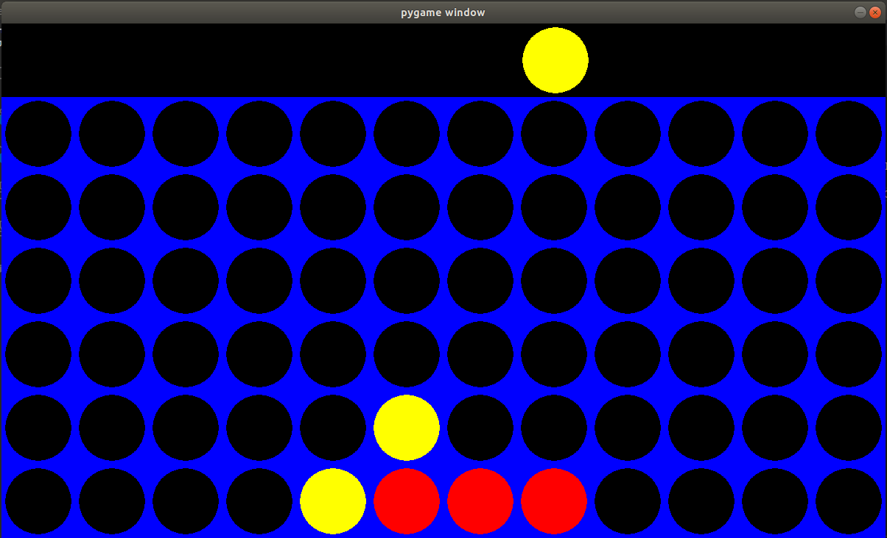

# MinimaxConnect4
###### EN
AI that can play connect 4 on a 12x6 board, using Minimax algorithm and a bitboard.
Please note that in this README, I'll consider that you know what a bitboard is and that you have a good understanding of [the Minimax algorithm]. For more detailed information, read [this article that I wrote] on [my web page].
**_Also, some part of my algorithm or codes that I picked up in other repositories : all the credits can be found below._**

## INTRODUCTION
A standard connect 4 game (on a 7x6 board) allow a total of 4,531,985,219,092 board configurations. Although it's a [solved game], computaing all these possible board states is close to impossible with our commun PC/laptop. This is getting way more harderon a 1x6 board. Thus, we will need a board representation that needs low calculations and also a way to rate each board state quickly without having to reach an endgame point with the Minimax algorithm. The solution that came to me was using [a bitboard] to represent each board state and a [heuristic function] to rate it.

## NECESSARIES
In order to use this code you'll need to have installed differents packages that are running on Python 3 : Numpy and Pygame.
I let you check their website in order to install properly these packages.
* [Numpy]
* [PYGAME]

## BITBOARD
I came accross this [interesting article] on TDS that cover the bitboard representation on the connect 4 game on a standard connect 4 game (you should read it before going further).I then decided to apply it to my code and to my 12x6 board. I've now coded it with objects.
I've changed the way to update the board, this function also tracks the number of token played per column while updating the mask and the position.
```python
def update_board(self, board, player):
        '''
        This function init the bitboard and track the number of tokens per column
        This code comes from the article found on Medium
        '''
        self.playerCount['human'] = 0
        self.playerCount['computer'] = 0
        mask, position = '', ''
        for j in range(11, -1, -1):
            self.moves[str(j)] = 0
            position += '0'
            mask += '0'
            #start with the upper row
            for i in range(6):
                position += ['0', '1'][board[i, j] == player]
                mask += ['0', '1'][board[i, j] != 0]
                if board[i, j] != 0:
                    self.moves[str(j)] += 1
                    if board[i, j] == 1:
                        self.playerCount['human'] += 1
                    elif board[i, j] == 2 :
                        self.playerCount['computer'] += 1
        self.position = int(position, 2)
        self.mask = int(mask, 2)
```
As you can see I use dictionnaries to keeps track of what's happening in each column since it's a more convenient and faster way to do so.
I also needed to change the make_move() function in order to keeps track of the the amount of token played for each participant.
```python
def make_move(self, col, mask, position, maxPlayer):
        '''
        This function add a token on the top of the bitboard and update the position board to be the opponent's one
        '''
        newPosition = position ^ mask #opponents turn, we switch to his board
        newMask = mask | (mask + (1 << (col*7)))
        if maxPlayer :
            self.playerCount['computer'] += 1
        else :
            self.playerCount['human'] += 1
        self.moves[str(col)] += 1
        return newMask, newPosition
```
Finally, I didn't have to change the way of checking for connected 4 since I have the same amount of rows as a standard column four.
```python
def connected_four(self, position):
        '''
        This code comes from the article found on Medium
        '''
        #Horizontal check
        check = position & (position >> 7)
        if check & (check >> 14) : 
            return True

        #Diagonal \
        check = position & (position >> 6)
        if check & (check >> 12) : 
            return True

        #Diagonal /
        check = position & (position >> 8)
        if check & (check >> 16) : 
            return True

        #Vertical
        check = position & (position >> 1)
        if check & (check >> 2): 
            return True

        return False
```

## HEURISTIC
I've decided to take a simple heuristic. I'll will briefly explain how it's working here but if you want detailed explanation, [go here].
My heuristic simply count the number of dangerous connected 4 and connected 2 played per each player. What I mean by "dangerous" is that, the connected n is not blocked yet. So my heuristic function can be written as : _H(board) = 3 x computerNumberOfThrees + computerNumberOfTwos - (3 x humanNumberOfThrees + humanNumberOfTwos)_ if there is no connected 4, else if there is computer connected 4 _H(board) = 10 000 - numberOfTokenPlayed_ else _H(board) = -(10 000 - NumberOfTokenPlayed)_. We assign a weight to the amount of connected 3 since it's a more dangerous state to take into consideration by the computer.
Here is an example : the yellow tokens are played by the computer (maximazing player) and the red ones by the human.
So what would be the grade of this particular board state ?

This board is not an end-game state so we use the first heuristic formula. We can notice that there is one dangerous connected 2 played by the computer (on the diagonal /) and 0 dangerous connected 3. On the other hand, the human has one dangerous connected 3 that need to ble blocked, but also one dangerous connected 2 implied by the connected 4. So we can rate this board state this way :
_H(board1) = 3 x 0 + 1 - (3 x 1 + 1) = -3_
This board is in our disadvantage since we want to maximaze our score. Something needs to be done. In order to avoid to loose, the computer now block the human, let's see how the board is now rated.

Now there is one dangerous connected 2 played by the computer and 0 connected 0. However, there isn't any dangerous connected 3 nor connected 2 played by the human anymore, so we have :
_H(board2) = 3 x 0 + 1 - (3 x 0 + 0) = 1_
This board is now in our advantage.

## CREDITS
* Huge thanks to [@KeithGalli] for letting [his connect 4 game] open source. I've changed some part of the code to fit my project. You can check his youtube video [here] !
* The heuristic I came up with comes from [this article].
* I've used a code from [GeeksForGeeks] to count the number of set bits on an integer.
```python
def count_set_bits(self, check):
        '''
        This fonction count the number of bits set to one in a binary representation of an integer
        '''
        count = 0
        while (check): 
            count += check & 1
            check >>= 1
        return count 
```
* Finally, huge thanks to [@charlyalizadeh] for letting me now about the bit boards as a way to lead this project.

[the Minimax algorithm]: https://www.youtube.com/watch?v=l-hh51ncgDI
[this article that I wrote]: https://kulumbaf.github.io/FrancisRepository/
[my web page]: https://kulumbaf.github.io/FrancisRepository/
[solved game]: https://en.wikipedia.org/wiki/Connect_Four#Mathematical_solution
[a bitboard]: https://www.youtube.com/watch?v=MzfQ8H16n0M&t=221s
[heuristic function]: https://en.wikipedia.org/wiki/Heuristic_(computer_science)
[Numpy]: https://www.scipy.org/install.html
[PYGAME]: https://www.pygame.org/wiki/GettingStarted
[interesting article]: https://towardsdatascience.com/creating-the-perfect-connect-four-ai-bot-c165115557b0
[go here]: https://kulumbaf.github.io/FrancisRepository/
[@KeithGalli]: https://github.com/KeithGalli
[his connect 4 game]: https://github.com/KeithGalli/Connect4-Python/blob/master/connect4.py
[here]: https://www.youtube.com/watch?v=MMLtza3CZFM&t=109s
[this article]: https://roadtolarissa.com/connect-4-ai-how-it-works/
[GeeksForGeeks]: https://www.geeksforgeeks.org/count-set-bits-in-an-integer/
[@charlyalizadeh]: https://github.com/charlyalizadeh